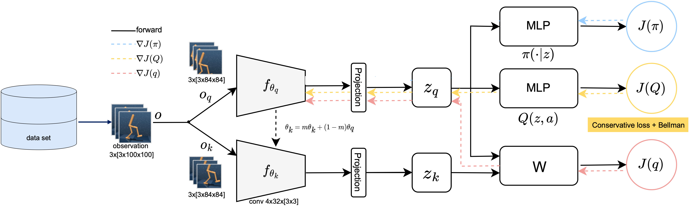
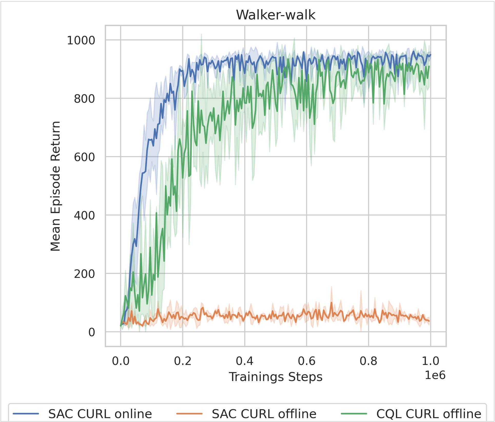

# Contrastive Offline Reinforcement Learning
This repo presents part of my bachelor thesis *Contrastive Offline Reinforcement Learning for Pixel to Control* at Karlsruhe Institute of Technology. I wrote the thesis under the supervision of Professor. Dr. Zöllner, Karam Daaboul and Philipp Stegmaier for the research group Applied Technical Coginitve Systems at the Institute of Applied Informatics and Formal Description Methods https://www.aifb.kit.edu/web/Thema4907/en.

In the thesis, we combine *Contrastive Unsupervised Representations for RL (CURL)* with *Conservative Q Learning (CQL).* The resulting RL algorithm *CQL CURL* is able to learn continuous control tasks from a previously collected data sets of visual observations. Two aspects are considered:

Learning from Images: 

* RL algorithms struggle to learn policies from images. These high dimensional observations are represented in a lower dimensional latent space using a contrastive objective in the training process with CURL.
* CURL: [CURL: Contrastive Unsupervised Representations for Reinforcement Learning](https://arxiv.org/abs/2004.04136) 


Offline RL
* Usually, RL agents interact with their environment during training to test their current policy and get better by maximising rewards. In offline RL, agents learn from an existing dataset without exploring the environment themselves. This poses problems concerning out-of-distribution actions. CQL uses a regularization term to solve this problem. 
* CQL [Conservative Q-Learning for Offline Reinforcement Learning] (https://arxiv.org/abs/2006.04779)

Our contribution is to show that by combining both algorithms, RL agents can learn from image observations in an offline RL setting.

This figure visualizes the algorithms optimisation procedure for the the neural network 



The repository is based in large parts on *Xing, Jinwei (2022). Pytorch Implementations of Reinforcement Learning Algorithms for Visual Continuous Control https://github.com/KarlXing/RL-Visual-Continuous-Control*. We implement the CQL loss regularisation in his SAC agent to produce our CQL CURL algorithm.


## Results
Our algorithm is showcased here in the DeepMind Control Suite walker environment. This figure compares the training progress of different algorithms to show the effectiveness of our algorithm CQL CURL. The blue curve shows the performance of a SAC CURL agent that is trained in an online setting. The orange curve shows that the same algorithm fails to learn a suitable policy in the offline setting. The green curve shows that our algorithm CQL CURL is able to learn a good policy in the offline setting. All Training runs are averaged over three seeds. The shading shows the range of episode rewards across the different seeds. 
 


For any questions, please contact me at adrianwiedemann1@gmail.com.

## Prerequesites
* installation of mujoco MuJoCo 2.1

## Instructions
Install MuJoCo 2.1 (please refer to [https://github.com/deepmind/dm_control](https://github.com/deepmind/dm_control). 

Create conda environment
```
conda create -n myenv -f env_visual_offline.yml
```
To run the code, we give some sample scripts. Please adjust the relevant paths and run the scripts like so:
```
conda activate myenv

#train expert agent as behavior policy
python src/scripts/train_behavior_policy.py

#collect offline data sets using behavior policies
python src/scripts/collect_walker_expert_dataset.py

#train cql curl agents offline
python src/scripts/train_cql_curl_offline.py
```

